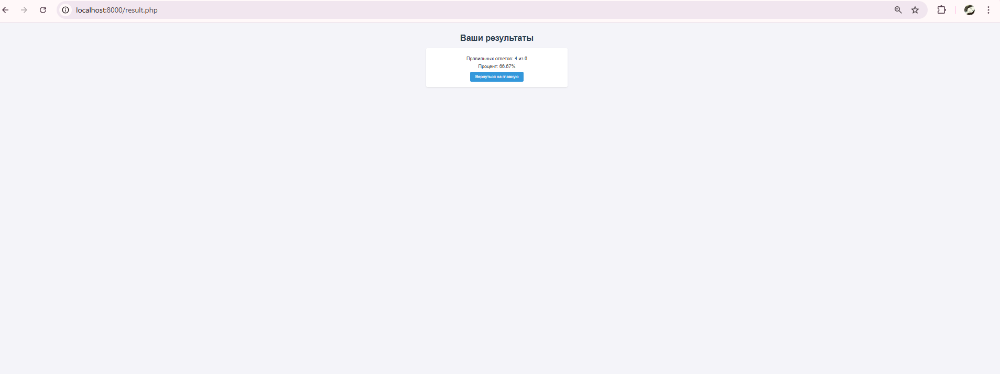

# Веб-приложение для прохождения тестов

## Краткое описание функционала приложения

Это веб-приложение на PHP позволяет пользователям проходить тест, состоящий из вопросов с одним или несколькими правильными ответами. Пользователь вводит своё имя, отвечает на вопросы, получает результаты (количество правильных ответов и процент), а затем может просмотреть таблицу всех результатов. Приложение разработано для анонимного использования и сохраняет данные в JSON-файлах.

### Основные возможности:
- Прохождение теста с 6 вопросами (5 с одним ответом, 1 с двумя).
- Отображение результатов: правильные ответы и процент.
- Просмотр всех результатов в таблице.
- Адаптивный интерфейс с использованием CSS.
  

## Краткое описание функционала приложения

Это веб-приложение на PHP позволяет пользователям проходить тест, состоящий из вопросов с одним или несколькими правильными ответами. Пользователь вводит своё имя, отвечает на вопросы, получает результаты (количество правильных ответов и процент), а затем может просмотреть таблицу всех результатов. Приложение разработано для анонимного использования и сохраняет данные в JSON-файлах.

### Основные возможности:
- Прохождение теста с 6 вопросами (5 с одним ответом, 1 с двумя).
- Отображение результатов: правильные ответы и процент.
- Просмотр всех результатов в таблице.
- Адаптивный интерфейс с использованием CSS.

---

## Инструкции по запуску проекта

### Требования
- PHP 7.4 или выше.
- Локальный веб-сервер (например, XAMPP, WAMP или встроенный сервер PHP).

### Установка
1. Склонируйте репозиторий или скачайте файлы:
```
git clone <URL_репозитория>
```
2. Поместите проект в папку веб-сервера (например, `htdocs` в XAMPP).
3. Убедитесь, что файлы `questions.json` и `answers.json` находятся в папке `data/`.
4. Запустите сервер:
- Если используете XAMPP, откройте `http://localhost/<папка_проекта>/index.php`.
- Если используете встроенный сервер PHP:
```
php -S localhost:8000
```
### Проверка
- Перейдите на главную страницу (`index.php`), нажмите "Пройти тест".
- Пройдите тест и проверьте результаты.
- Откройте `dashboard.php` для просмотра таблицы.


---


### Вопросы и правильные ответы
Приложение использует два файла: `questions.json` (вопросы) и `answers.json` (правильные ответы). Вот примеры:

#### Пример вопроса с одним ответом
- **Вопрос**: "Какой оператор используется для сравнения значений в PHP?"
- **Варианты**: `"="`, `"=="`, `"==="`, `"=!"`
- **Правильный ответ**: `"=="`

#### Пример вопроса с двумя ответами
- **Вопрос**: "Какие из этих способов можно использовать для создания массива в PHP?"
- **Варианты**: `"array()"`, `"[]"`, `"{}"`, `"new Array()"`
- **Правильные ответы**: `"array()"`, `"[]"`

---


## Структура базы данных или файла

Проект использует JSON-файлы вместо базы данных. Всего три файла в папке `data/`:

### 1. `questions.json`
- **Описание**: Содержит вопросы, их тип и варианты ответов.
- **Структура**:
  - `id` (число): Уникальный идентификатор вопроса.
  - `question` (строка): Текст вопроса.
  - `type` (строка): Тип вопроса (`"single"` — один ответ, `"multiple"` — несколько).
  - `options` (массив строк): Варианты ответа
  

###  2.  `answers.json`
- **Описание**: Содержит правильные ответы для каждого вопроса.
- **Структура**:
  - `id` (число): Соответствует id из questions.json.
correct (строка или массив строк): Правильный ответ (строка для "single", массив для "multiple").

### 3. `results.json`
- **Описание**: Хранит результаты пользователей (создаётся автоматически).
- **Структура**:
    - **name (строка)**: Имя пользователя.
    - **score (число)**: Процент правильных ответов.

---

### Тестирование
1. Запустите приложение.
2. Введите имя, например, "Анна".
3. Ответьте на все вопросы:
- Выберите `"=="` для вопроса 1.
- Выберите `"array()"` для вопроса 2.
- Выберите `"function"` для вопроса 3.
- Выберите `"Проверяет, была ли переменная инициализирована."` для вопроса 4.
- Выберите `"Все вышеперечисленное"` для вопроса 5.
- Выберите `"array()"` и `"[]"` для вопроса 6.
4. Получите результат: "Правильных ответов: 6 из 6, Процент: 100%".
5. Проверьте `dashboard.php` — результат "Анна, 100%" будет в таблице.

---

## Скриншоты работы приложения

Главная страница (index.php)
   

Страница теста (test.php)
    

Страница результатов (result.php)
    

